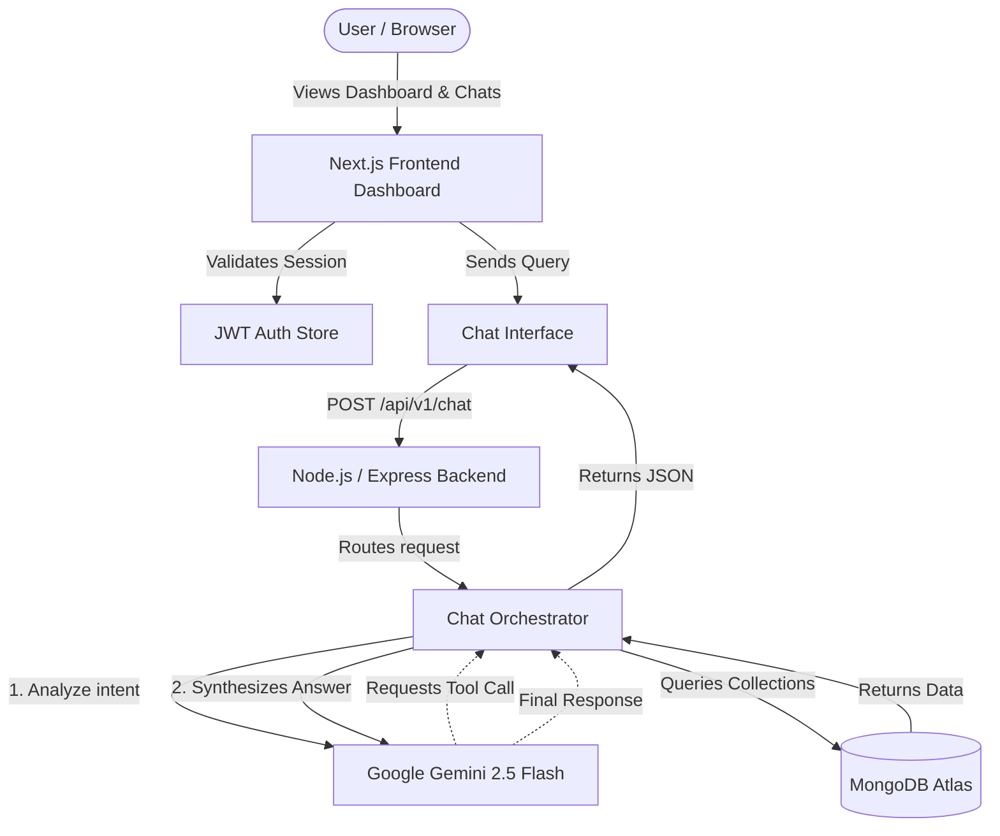
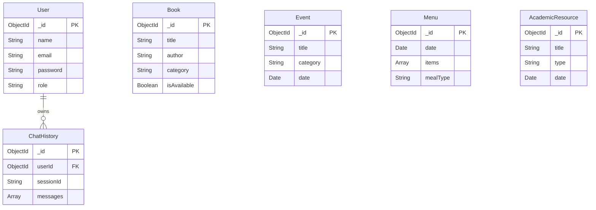

# 🎓 Campus AI Assistant - Unified Campus Intelligence Dashboard

 <!-- Replace with actual demo screenshot path -->

## 🌟 Overview
College campuses have data scattered everywhere—legacy library portals, PDF cafeteria menus, Google Calendar events, and massive academic PDFs. Students waste time digging through 5 different systems just to find out if a book is available or what time a tech fest workshop starts.

**Campus AI Assistant** solves this by providing a Unified Web Dashboard featuring an embedded AI Assistant. Instead of building massive web scrapers, this project implements independent servers for each campus data source. The AI dynamically queries these servers in real-time using Function Calling based on student natural-language queries.


## ✨ Key Features
- **🧠 Real-Time AI Orchestrator:** Uses Google's Gemini 2.5 Flash to understand user queries and route them to the appropriate database tool in real time.
- **🔌 Independent Data Servers:** Distinct API services built for Library, Cafeteria, Events, and Academics.
- **📊 Unified Dashboard UI:** A beautiful, responsive dashboard that surfaces live results from multiple sources in one view, including a "Recent Activity" feed powered by real backend data.
- **🔐 Secure Authentication:** Full JWT-based authentication system with persistent Zustand sessions, allowing for personalized student accounts.
- **🛡️ Production Hardened:** Features API Rate Limiting, Helmet Security Headers, Zod Input Validation, and Exponential Backoff Retry Algorithms for the AI engine.

## 🛠️ Tech Stack
- **Frontend:** Next.js (React), Tailwind CSS, Zustand (State Management), Lucide Icons
- **Backend:** Node.js, Express.js, TypeScript, Mongoose
- **Database:** MongoDB Atlas (NoSQL)
- **AI Integration:** Google Gen AI SDK (`@google/genai`) - *Gemini 2.5 Flash*

## 🏗️ Architecture Blueprint



## 🗄️ Database Schema



## 🚀 Setup & Installation

### Prerequisites
- Node.js (v18 or higher)
- MongoDB Atlas Account (or local MongoDB)
- Google Gemini API Key

### 1. Clone the repository
```bash
git clone https://github.com/Ra-j-at-arora/campus-ai-assistant.git
cd campus-ai-assistant
```

### 2. Backend Setup
```bash
cd backend
npm install
```
Create a `.env` file in the `backend` directory:
```env
PORT=5000
MONGO_URI=your_mongodb_connection_string
JWT_SECRET=your_super_secret_jwt_key
GEMINI_API_KEY=your_google_gemini_api_key
CLIENT_URL=http://localhost:3000
```
Run the backend:
```bash
npm run dev
```

### 3. Frontend Setup
Open a new terminal and navigate to the frontend directory:
```bash
cd frontend
npm install
```
Create a `.env.local` file in the `frontend` directory:
```env
NEXT_PUBLIC_API_URL=http://localhost:5000/api/v1
```
Run the frontend:
```bash
npm run dev
```

### 4. Open the App
Visit `http://localhost:3000` in your browser. Register a new account and start chatting with your Campus AI!

## 🎥 Demo Video
[Insert Link to 5-10 minute YouTube/Google Drive Demo Video Here]

## 📝 License
This project was built by Rajat Arora. All rights reserved.
