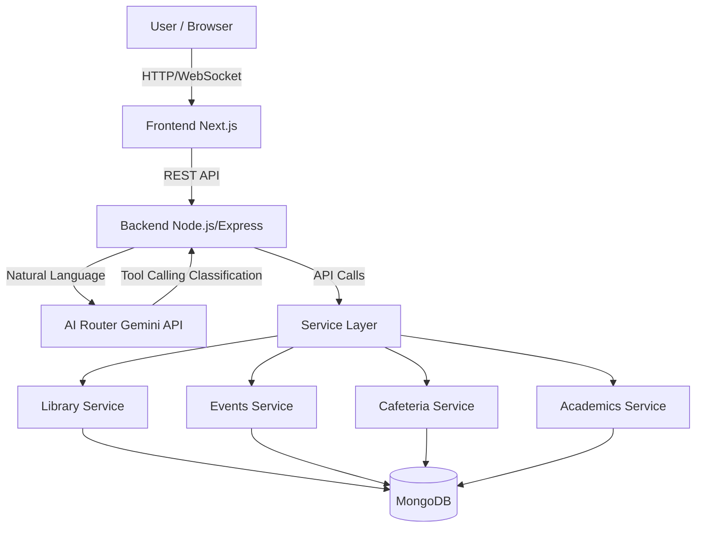

# Unified Campus Intelligence Dashboard - Technical Architecture Blueprint

## SECTION 1: PROJECT VISION

### Problem Solved
College campuses have data scattered across multiple legacy systems, PDFs, and separate web portals. Students waste significant time navigating these fragmented systems to find basic information such as library book availability, cafeteria menus, or event schedules.

### Target Audience
- **Primary Users:** Students looking for quick, unified access to campus information.
- **Secondary Users:** Faculty and administration (for broadcasting announcements, updating academic resources).
- **Administrators:** IT and staff monitoring campus data and system analytics.

### Expected User Journey
1. **Onboarding:** User registers/logs in using campus credentials.
2. **Dashboard Overview:** User lands on a unified dashboard displaying real-time widgets (Today's Menu, Upcoming Events, Academic Deadlines).
3. **AI Interaction:** User types or speaks a query in the AI Assistant chat interface (e.g., "Where is the ML workshop today?").
4. **Intelligent Routing:** The AI routes the query to the specific backend service (Events Service), fetches real-time data, and responds contextually.
5. **Actionable Insights:** User gets the exact location, time, and option to RSVP directly through the chat.

### Major Use Cases
- **Library Inquiry:** "Is 'Operating System Concepts' available?"
- **Cafeteria Menu:** "What is today's cafeteria menu?"
- **Campus Events:** "When is the next coding club event?"
- **Academics:** "When are the mid-sem exams?"
- **Multi-Service Query:** "Are there any events after my 3 PM lecture today, and what's open in the cafeteria?"

### System Goals
- **Unification:** Consolidate disparate data silos into a single, cohesive interface.
- **Speed & Accuracy:** Provide real-time, accurate answers using an AI-powered conversational interface.
- **Scalability:** Utilize a modular, microservice-inspired architecture (via MCP/independent services) that allows easy addition of new campus domains.
- **Maintainability:** Ensure high code quality through SOLID principles and strict TypeScript typing.

---

## SECTION 2: SYSTEM ARCHITECTURE

### Complete Architecture Explanation
The system follows a modular, client-server architecture with an intelligent routing layer powered by Google Gemini. The architecture ensures separation of concerns, allowing individual campus services to be scaled, updated, or replaced independently without affecting the broader system.



### Layer Responsibilities
- **Frontend (Next.js 15, React, Tailwind):** Handles user interactions, state management, and rendering of the unified dashboard and chat interface.
- **Backend (Node.js, Express, TS):** Acts as the central gateway. Manages authentication, rate limiting, and orchestrates requests between the frontend, the AI, and the internal services.
- **AI Router (Gemini API):** Analyzes the user's natural language query, determines intent, and uses function/tool calling to dictate which campus service should be queried.
- **Service Layer (Modular Services):** Independent modules handling business logic for specific domains. They can be conceptualized as Model Context Protocol (MCP) servers.
- **Database (MongoDB):** Centralized (but logically partitioned) NoSQL data store managing all campus entities.

### Request Flow
1. User submits a query via the frontend.
2. Frontend sends an API request to the Backend `/api/chat` endpoint.
3. Backend forwards the raw prompt to the **AI Router**.
4. The AI Router identifies the intent and returns a "Tool Call" specifying the service (e.g., `getCafeteriaMenu(date)`).
5. Backend executes the requested tool by calling the **Service Layer**.
6. Service Layer queries **MongoDB**, processes the data, and returns JSON.
7. Backend sends the JSON back to the AI Router to format a natural language response.
8. Backend streams or sends the final response to the Frontend.

---

## SECTION 3: MODULE BREAKDOWN

### 1. Authentication Module
- **Purpose:** Secure user identity and session management.
- **Responsibilities:** Login, Registration, JWT issuance/validation, Password hashing (bcrypt).
- **Inputs:** Credentials (email, password).
- **Outputs:** JWT access tokens, User profile data.
- **Dependencies:** Database (Users collection), JWT library, bcrypt.
- **Future Scalability:** Can be transitioned to SSO (OAuth 2.0 / Campus ID) in the future.

### 2. Library Module
- **Purpose:** Manage inventory and availability of books and media.
- **Responsibilities:** Search catalog, check availability, manage reservations.
- **Inputs:** Search queries (title, author, ISBN).
- **Outputs:** Book details, location, status (available/checked-out).
- **Dependencies:** Database (Books collection).
- **Future Scalability:** Integration with physical RFID scanning systems.

### 3. Events Module
- **Purpose:** Centralize campus activities, club meetings, and workshops.
- **Responsibilities:** List upcoming events, filter by category/date, manage RSVPs.
- **Inputs:** Date ranges, club IDs, categories.
- **Outputs:** Event schedules, locations, descriptions.
- **Dependencies:** Database (Events collection).
- **Future Scalability:** Syncing with external calendars (Google Calendar API).

### 4. Cafeteria Module
- **Purpose:** Digitize campus dining menus and operational hours.
- **Responsibilities:** Provide daily menus, dietary information, and pricing.
- **Inputs:** Date, meal type (breakfast/lunch/dinner).
- **Outputs:** Menu items, allergens, prices.
- **Dependencies:** Database (Menus collection).
- **Future Scalability:** Future integration for live queue wait-times or pre-ordering.

### 5. Academics Module
- **Purpose:** Serve academic calendars, course schedules, and notices.
- **Responsibilities:** Retrieve exam dates, term schedules, faculty notices.
- **Inputs:** Academic terms, course codes.
- **Outputs:** Deadlines, notices, syllabus links.
- **Dependencies:** Database (AcademicResources collection).
- **Future Scalability:** Connecting with existing LMS (Canvas/Moodle) via APIs.

### 6. AI Assistant Module
- **Purpose:** Act as the intelligent orchestrator bridging users and services.
- **Responsibilities:** NLP parsing, intent classification, prompt management, tool execution coordination.
- **Inputs:** User text/voice queries, context history.
- **Outputs:** Tool call requests, final synthesized natural language responses.
- **Dependencies:** Gemini API, all other Domain Services.
- **Future Scalability:** Implementing semantic search/RAG for complex handbook PDFs.

### 7. Analytics Module
- **Purpose:** Track system usage and monitor AI performance.
- **Responsibilities:** Log queries, monitor service latency, track popular intents, measure error rates.
- **Inputs:** System events, AI classification results, response times.
- **Outputs:** Aggregated metrics, admin dashboards.
- **Dependencies:** Database (QueryLogs, Analytics collections).
- **Future Scalability:** Transition to time-series DB (InfluxDB) or Elasticsearch for heavy loads.

---

## SECTION 4: DATABASE DESIGN

### 1. Users
- **Purpose:** Store user credentials and preferences.
- **Fields:** `_id` (ObjectId), `name` (String), `email` (String), `passwordHash` (String), `role` (Enum: STUDENT, ADMIN), `createdAt` (Date).
- **Indexes:** Unique index on `email`.
- **Validation:** Valid email format, required name and password.

### 2. Books
- **Purpose:** Library catalog.
- **Fields:** `_id` (ObjectId), `title` (String), `author` (String), `isbn` (String), `status` (Enum: AVAILABLE, RESERVED, CHECKED_OUT), `locationCode` (String).
- **Indexes:** Text index on `title` and `author`. Unique index on `isbn`.
- **Validation:** Required title, author, isbn.

### 3. Events
- **Purpose:** Campus event schedule.
- **Fields:** `_id` (ObjectId), `title` (String), `description` (String), `organizer` (String), `location` (String), `startTime` (Date), `endTime` (Date), `category` (String).
- **Indexes:** Ascending index on `startTime`.
- **Validation:** `endTime` must be strictly greater than `startTime`.

### 4. Menus
- **Purpose:** Cafeteria daily offerings.
- **Fields:** `_id` (ObjectId), `date` (Date), `mealType` (Enum: BREAKFAST, LUNCH, DINNER), `items` (Array of Objects: `{ name: String, isVeg: Boolean, allergens: [String] }`).
- **Indexes:** Compound index on `date` and `mealType`.
- **Validation:** Unique `mealType` per `date`.

### 5. AcademicResources
- **Purpose:** Deadlines and academic calendar.
- **Fields:** `_id` (ObjectId), `title` (String), `type` (Enum: EXAM, HOLIDAY, DEADLINE), `date` (Date), `description` (String), `term` (String).
- **Indexes:** Index on `date` and `term`.

### 6. ChatHistory
- **Purpose:** Retain context for AI conversations.
- **Fields:** `_id` (ObjectId), `userId` (ObjectId, ref: Users), `sessionId` (String), `messages` (Array: `{ role: String, content: String, timestamp: Date }`).
- **Indexes:** Index on `userId` and `sessionId`.

### 7. QueryLogs
- **Purpose:** Log system usage and performance.
- **Fields:** `_id` (ObjectId), `userId` (ObjectId), `query` (String), `routedService` (String), `responseTimeMs` (Number), `success` (Boolean), `timestamp` (Date).
- **Indexes:** TTL index on `timestamp` (e.g., expire after 90 days).

### 8. Analytics
- **Purpose:** Pre-aggregated dashboard statistics.
- **Fields:** `_id` (ObjectId), `date` (Date), `totalQueries` (Number), `serviceUsage` (Object mapping Service Name to Count), `errorCount` (Number).
- **Indexes:** Unique index on `date`.

---

## SECTION 5: API DESIGN

All endpoints prefixed with `/api/v1`

### Authentication
- **Endpoint:** `/auth/login`
- **Method:** `POST`
- **Purpose:** Authenticate user and return JWT.
- **Request:** `{ "email": "student@campus.edu", "password": "pass" }`
- **Response:** `{ "token": "eyJ...", "user": { "id": "1", "name": "John" } }`
- **Error Responses:** `401 Unauthorized`, `400 Bad Request`.

### Library
- **Endpoint:** `/library/search`
- **Method:** `GET`
- **Purpose:** Search for books.
- **Request:** `?query=operating+system`
- **Response:** `{ "books": [ { "title": "OS Concepts", "status": "AVAILABLE", "locationCode": "A1-B2" } ] }`
- **Error Responses:** `500 Internal Server Error`.

### Events
- **Endpoint:** `/events/upcoming`
- **Method:** `GET`
- **Purpose:** Fetch events from today onwards.
- **Request:** `?limit=5`
- **Response:** `{ "events": [ { "title": "Coding Club", "startTime": "2026-06-15T18:00:00Z", "location": "Room 101" } ] }`
- **Error Responses:** `500 Internal Server Error`.

### Cafeteria
- **Endpoint:** `/cafeteria/menu`
- **Method:** `GET`
- **Purpose:** Get menu for a specific date.
- **Request:** `?date=2026-06-14`
- **Response:** `{ "menu": { "LUNCH": [ { "name": "Pasta", "isVeg": true } ] } }`
- **Error Responses:** `404 Not Found`.

### Academics
- **Endpoint:** `/academics/calendar`
- **Method:** `GET`
- **Purpose:** Fetch academic deadlines.
- **Request:** `?term=Fall2026`
- **Response:** `{ "resources": [ { "title": "Mid-Sem Exams", "date": "2026-10-10" } ] }`
- **Error Responses:** `400 Bad Request`.

### Chat (AI)
- **Endpoint:** `/chat/message`
- **Method:** `POST`
- **Purpose:** Process natural language query.
- **Request:** `{ "message": "What is for lunch today?", "sessionId": "abc-123" }`
- **Response:** `{ "reply": "Today's lunch features Pasta (Veg) and Grilled Chicken.", "sources": ["Cafeteria"] }`
- **Error Responses:** `401 Unauthorized`, `429 Too Many Requests`.

### Analytics
- **Endpoint:** `/analytics/summary`
- **Method:** `GET`
- **Purpose:** Retrieve system usage statistics for the admin dashboard.
- **Request:** `?startDate=2026-06-01&endDate=2026-06-30`
- **Response:** `{ "totalQueries": 1500, "mostActiveService": "Cafeteria", "avgResponseTimeMs": 850 }`
- **Error Responses:** `403 Forbidden` (Admin Only).

---

## SECTION 6: AI ASSISTANT DESIGN

### AI Routing System
The core engine relies on **Function/Tool Calling** utilizing the Gemini API.

**Classification Logic:**
1. **System Prompt:** Instructs Gemini that it is a campus assistant with access to specific tools: `query_library`, `query_events`, `query_cafeteria`, `query_academics`.
2. **User Input:** "When is the next coding event?"
3. **Tool Selection:** Gemini analyzes the prompt and returns a structured tool call: `query_events({ category: "coding", time_frame: "upcoming" })`.

**Confidence Score & Fallback:**
If Gemini cannot confidently map the query to a tool (Unknown Service), it triggers a fallback response: "I'm sorry, I don't have access to that information. I can help with Library, Events, Cafeteria, and Academics."

**Multi-Service Queries:**
For queries like: "Are there any events after my library visit today, and what's for dinner?"
- Gemini is configured to output *Parallel Tool Calls*.
- It calls `query_events()` and `query_cafeteria()` simultaneously.
- The backend executes both, aggregates the JSON, and feeds it back to Gemini for a unified synthesis.

**Error Handling:**
- If a downstream service is down (e.g., Cafeteria DB timeout), the backend catches the error and returns a predefined JSON error to Gemini: `{ "error": "Cafeteria service unavailable" }`.
- Gemini synthesizes this gracefully: "I found your events, but the cafeteria system is currently down. Please check back later."

---

## SECTION 7: USER INTERFACE DESIGN

### General Aesthetic
Modern, clean, campus-branded UI. High use of whitespace, clear typography, and responsive grid layouts.

### 1. Login / Register
- **Purpose:** Entry point for users.
- **Components:** Auth forms, Campus Logo, SSO Buttons, Forgot Password link.
- **Data Displayed:** Email/Password fields.
- **User Actions:** Submit credentials, toggle login/register.
- **Responsive:** Centered card on desktop, full-width on mobile.
- **Wireframe:** Split screen desktop (Graphic left, Form right), Single stack mobile.

### 2. Dashboard (Home)
- **Purpose:** Glanceable overview of campus life.
- **Components:** Header (Greeting, Profile Icon), Quick Widgets, Floating Action Button (FAB) for Chat.
- **Data Displayed:** Today's Menu card, Next Event card, Active Book Loans card.
- **User Actions:** Click widgets for details, open AI chat.
- **Responsive:** CSS Grid (3 columns on desktop, 1 column stacked on mobile).
- **Wireframe:** Top Nav -> 3 Grid Cards -> Bottom right FAB.

### 3. AI Chat Interface
- **Purpose:** Primary interaction layer.
- **Components:** Message list (scrollable), Input field, Send button, "Typing..." indicators, Suggested Prompts ("What's for lunch?").
- **Data Displayed:** User messages (right), AI messages (left), Rich UI cards embedded in chat (e.g., a styled Menu Card instead of raw text).
- **User Actions:** Type message, send, click quick prompts.
- **Responsive:** Full height taking over screen on mobile, slide-out sidebar on desktop.
- **Wireframe:** Classic chat UI. Message bubbles with Markdown support.

### 4. Analytics (Admin)
- **Purpose:** Monitor system health.
- **Components:** Line charts, Bar charts, Stat cards, Date pickers.
- **Data Displayed:** Queries per day, service load distribution, average latency.
- **User Actions:** Filter by date, export CSV.
- **Responsive:** Fluid charts resizing to container width.
- **Wireframe:** Dashboard layout with top KPI cards and bottom large charts.

### 5. Profile
- **Purpose:** Manage account.
- **Components:** User details form, Logout button, Theme toggle (Dark/Light mode).
- **Data Displayed:** Name, Email, Academic Role.
- **User Actions:** Update password, toggle theme, log out.
- **Responsive:** Single column form layout.
- **Wireframe:** Simple settings menu layout.

---

## SECTION 8: FOLDER STRUCTURE

### Frontend (Next.js)
```text
/frontend
 ├── /src
 │    ├── /app                 # Next.js App Router pages (/, /dashboard, /chat)
 │    ├── /components          # Reusable React components
 │    │    ├── /ui             # Buttons, Inputs, Cards (Design System)
 │    │    ├── /chat           # Chat UI components (Bubbles, Inputs)
 │    │    └── /widgets        # Dashboard widgets
 │    ├── /lib                 # Utility functions, Axios/Fetch API clients
 │    ├── /hooks               # Custom React hooks (e.g., useAuth)
 │    ├── /types               # TypeScript interfaces
 │    └── /styles              # Global CSS, Tailwind config
 ├── public                    # Static assets (images, icons)
 ├── package.json
 └── tailwind.config.ts
```
**Scalability:** Uses App Router for intuitive file-based routing. Components are strictly separated from pages.

### Backend (Node.js/Express)
```text
/backend
 ├── /src
 │    ├── /config         # Env variables, DB connection
 │    ├── /controllers    # Route handlers (LibraryController, ChatController)
 │    ├── /services       # Business logic (LibraryService, AIRouterService)
 │    ├── /routes         # Express route definitions
 │    ├── /models         # Mongoose schema definitions
 │    ├── /middlewares    # Auth verification, Error handling, Rate limiting
 │    └── /utils          # Prompts, logger, helpers
 ├── package.json
 └── tsconfig.json
```
**Scalability:** Follows MVC/Service-oriented architecture. Controllers only handle HTTP logic, while Services handle core business logic, making it easy to extract a Service into a microservice later.

---

## SECTION 9: SECURITY DESIGN

- **Authentication Flow:** Passwords hashed with bcrypt. Login returns a short-lived JWT (Access Token, 15m) and an HttpOnly Refresh Token (7d).
- **JWT Strategy:** Tokens signed using RS256 algorithm. Contains user ID and role.
- **Input Validation:** Use `Zod` or `Joi` on the backend to validate all incoming request bodies and prevent NoSQL injection.
- **Rate Limiting:** `express-rate-limit` implemented on `/chat/message` (e.g., 20 requests/minute) to prevent API abuse and control Gemini API costs.
- **Prompt Injection Prevention:**
  - Strict system prompts bounding the AI's persona.
  - User input sanitization.
  - The AI has **no direct DB write access**; it only outputs structured tool requests which the backend strictly validates before executing.
- **API Protection:** Express middleware verifies JWT on all `/api/v1/` routes (except login/register).
- **Role-Based Access:** Standard users can only READ data. ADMIN roles (via specific portal) are required for POST/PUT/DELETE operations on events and menus.
- **Future Security Upgrades:** Implement OAuth 2.0 (Google Workspace / Campus SSO) and WAF (Web Application Firewall).

---

## SECTION 10: DEVELOPMENT ROADMAP

### Phase 1: Foundation
- **Objectives:** Setup repos, configure DB, establish CI/CD.
- **Tasks:** Init Next.js & Node.js, setup MongoDB schemas, implement JWT Auth.
- **Dependencies:** Environment variables defined.
- **Expected Output:** Working login/register flow.

### Phase 2: Campus Services
- **Objectives:** Build core REST APIs.
- **Tasks:** Implement Library, Events, Cafeteria, Academics routes and test with Postman. Populate dummy data.
- **Dependencies:** Phase 1 Auth logic.
- **Expected Output:** Complete Backend CRUD functionality.

### Phase 3: AI Assistant
- **Objectives:** Integrate Gemini API.
- **Tasks:** Setup basic prompt engineering, create the `/chat/message` endpoint, establish chat history tracking.
- **Dependencies:** API Key access.
- **Expected Output:** AI responds contextually but without live data yet.

### Phase 4: Tool Calling
- **Objectives:** Make AI intelligent and data-driven.
- **Tasks:** Define Gemini Tools for all services. Write backend logic to catch tool requests, call internal APIs, and return results to Gemini.
- **Dependencies:** Phase 2 and Phase 3 completion.
- **Expected Output:** AI accurately answers questions based on DB state.

### Phase 5: Chat Interface
- **Objectives:** Build Dashboard and Chat UI.
- **Tasks:** Implement Next.js pages, integrate Tailwind, build real-time chat feel, connect widgets to APIs.
- **Dependencies:** Backend APIs live.
- **Expected Output:** A functional web client.

### Phase 6: Analytics
- **Objectives:** Track usage and system health.
- **Tasks:** Implement query logging, admin dashboard UI, error boundary handling.
- **Dependencies:** Phase 5 completion.
- **Expected Output:** Admin metrics panel.

### Phase 7: Deployment
- **Objectives:** Go live.
- **Tasks:** Deploy Frontend to Vercel. Deploy Backend to Render/Railway. Provision MongoDB Atlas.
- **Dependencies:** All code tested.
- **Expected Output:** Production URLs for the Campus Dashboard.

---

## SECTION 11: RISK ANALYSIS

| Risk Category | Specific Risk | Mitigation Strategy |
| :--- | :--- | :--- |
| **Technical** | Next.js/Node.js version mismatch | Use NVM and strictly define `.nvmrc` and `engines` in package.json. |
| **AI** | Hallucinations regarding campus data | Force AI to use Tool Calling strictly. Append "Respond ONLY with data provided by tools" to system prompt. Set Low Temperature. |
| **Database** | Slow query times on Chat History | Implement pagination and index `userId` + `sessionId`. |
| **Scalability** | High Gemini API latency | Add caching layer (Redis) for identical queries (e.g., "Menu today"). |
| **Deployment** | WebSocket/Stream drops on Vercel | Use Server-Sent Events (SSE) or simple HTTP polling for chat instead of WebSockets to suit Serverless environments. |

---

## SECTION 12: FINAL IMPLEMENTATION PLAN

*A clear, linear development order suitable for a student team to maximize parallelization and minimize blockers.*

**1. Scaffold & Database Setup (First)**
- Define Mongoose schemas.
- Setup Express server skeleton.
- Connect to MongoDB local/Atlas.

**2. Core APIs & Auth (Second)**
- Build user authentication (JWT).
- Build the endpoints to query Events, Books, and Menus.
- Test all APIs with Postman.
- *Testing:* Ensure Auth middleware protects routes properly.

**3. Frontend Shell (Third)**
- Setup Next.js with Tailwind CSS.
- Build Login/Register UI.
- Build the Dashboard layout (Widgets).
- Connect Frontend to Phase 2 APIs.

**4. AI Routing Engine (Fourth)**
- Write the System Prompt and Tool Definitions for Gemini.
- Create the backend AI controller that intercepts user input, calls Gemini, executes the required Tool (e.g., fetching a book), and returns the final response.
- *Testing:* Console/Postman testing to ensure AI triggers the correct service tools based on natural language.

**5. Chat UI Integration (Fifth)**
- Build the conversational interface in Next.js.
- Handle loading states ("AI is thinking...").
- Parse markdown responses.

**6. Deployment & Polish (Sixth)**
- Migrate DB to MongoDB Atlas.
- Deploy backend to Render.
- Deploy frontend to Vercel.
- *Postponed (For v2):* Analytics Dashboard, Voice integration, complex RAG pipelines.
